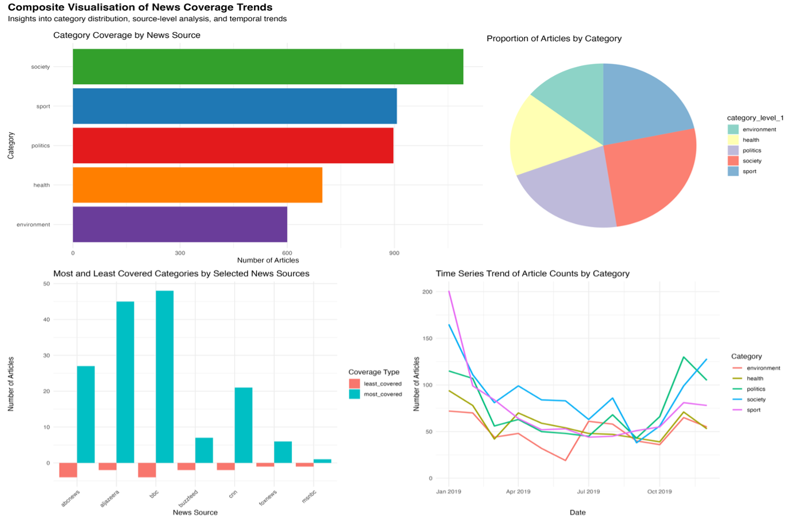

# News Coverage Visualizations

An analysis of news coverage trends using composite visualizations created in R.

## Introduction

This project investigates patterns in news coverage across categories and sources, focusing on disparities, source-level biases, and temporal trends. The composite visualizations include a bar chart, pie chart, grouped bar chart, and time series plot to provide insights into underrepresented topics, category proportions, and temporal dynamics in reporting. The aim is to highlight reporting biases and inform data-driven discussions on equitable media representation.

## Research Questions

1. What are the patterns in news coverage across categories and sources?
2. How do these trends evolve over time?

## Composite Visualizations

The composite visualization integrates the following charts:
- **Bar Chart**: Shows category coverage by news sources, highlighting the dominance of certain topics like politics and sport.
- **Pie Chart**: Displays the proportional distribution of categories in news coverage.
- **Grouped Bar Chart**: Illustrates the most and least covered categories across selected news sources.
- **Time Series Plot**: Tracks temporal trends in article counts for each category.

### Example Visualization



## Key Messages

- Disparities in category coverage exist, with politics and sports often dominating, while critical topics like health and environment are underrepresented.
- Temporal trends reveal spikes in specific categories, such as health during a pandemic or politics during elections.
- Source-level biases indicate varying priorities in news coverage across organizations.

## How to Reproduce

To reproduce the visualizations, follow these steps:

1. Clone this repository:
   ```bash
   git clone https://github.com/Veenkatacharan/INF4000.github.io.git
